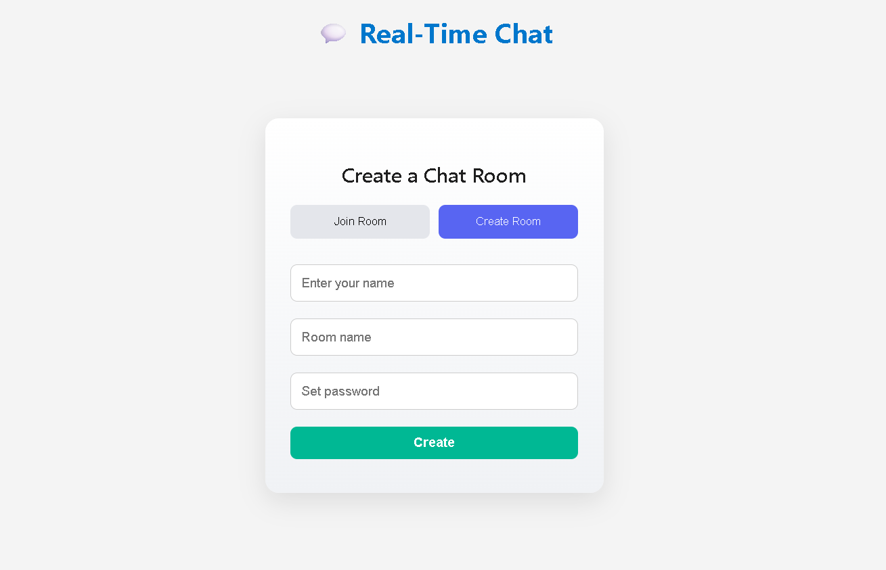

# 💬 Real-time Chat App
A real-time chat application with rooms, dark mode, emoji picker, file upload, and user moderation.

A modern, responsive, real-time chat application built with **Node.js**, **Express**, **Socket.IO**, and **Multer**. It supports multiple rooms, file sharing, emoji picker, dark/light theme toggle, and sound notifications.

---

## 🚀 Features

- 🔒 Create or join chat rooms  
- 👤 Username handling  
- 💬 Real-time messaging using Socket.IO  
- 📎 File upload support (images, documents, etc.)  
- 😀 Emoji picker  
- 🌗 Light/Dark mode toggle  
- 🔔 Sound notification on new messages  
- 📱 Responsive design for desktop and mobile  

---

## 🛠️ Technologies Used

- **Frontend:** HTML, CSS, JavaScript  
- **Backend:** Node.js, Express.js  
- **Real-time:** Socket.IO  
- **File Uploads:** Multer  
- **UI/UX:** Responsive design + theme toggle  

---

## 📁 Project Structure

chat-app/
├── public/
│ ├── chat.html
│ ├── index.html
│ ├── style.css
│ └── client.js
├── uploads/ # Stores uploaded files
├── notifications.mp3 # Notification sound
├── server.js
├── package.json
├──preview.png
└── README.md

## ▶️ How to Run Locally
### 1. Clone the Repository
git clone https://github.com/SahilMunj/Real-time-chat-app.git
cd Real-time-chat-app
2. Install Dependencies
npm install

3. Start the Server
node server.js

4. Open in Browser
http://localhost:3000
🌐 Deployment
You can deploy this app using:

Render

Vercel (Frontend + API proxy)

## 🌐 Live Preview

  

👉 Click the preview image above to open the live app.

📄 License
This project is licensed under the MIT License.

🙌 Credits
Made with ❤️ by Sahil Munj